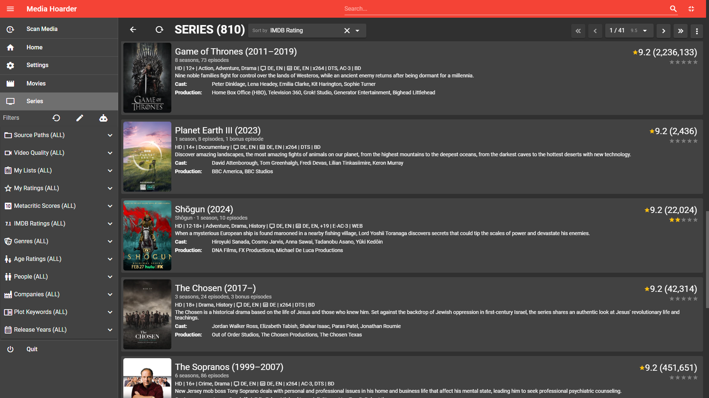

# Media Hoarder

**Media Hoarder** is THE frontend for your Movie and TV Series collection if you love metadata, filter abilities and easy management.

**Media Hoarder**:

- scans your movies and tv series (local or NAS, you define the source paths)
- gathers metadata using mediainfo and imdb.com
- provides a frontend to browse your collection and play your media (running the media player of your choice, e.g. VLC)

## Screenshots

_Media Hoarder's movie list_


<details>

<summary>Click Here For More Screenshots</summary>

_Details about an actor including the movies they are involved in as well as their role_


_Access individual movies in any list_


_Let ChatGPT generate movie lists_


_Media Hoarder's series list_



_Episode rating heatmap for a series_


_Access individual episodes from the rating heatmap_


_Details of an actor and their involvement in series / episodes_


</details>

## Features

- Start a conversation with ChatGPT and apply the results to your media <https://www.youtube.com/watch?v=EqiChgd2iuo>
- Tons of metadata from imdb.com including poster images
- Metadata from mediainfo analysis
- Filter by multiple criteria

  - Source Paths (e.g. distinguish between files on your NAS and locally available ones)
  - Video Quality (e.g. 720p, HD, 4k etc.)
  - Audio Languages
  - Subtitle Languages
  - Your Lists
  - Your Rating (5-star)
  - Metacritic Score
  - IMDB Rating (10-star)
  - Genres
  - Ages
  - Content Advisory
    - Sex & Nudity
    - Violence & Gore
    - Profanity
    - Alcohol, Drugs & Smoking
    - Frightening & Intense Scenes
  - People (e.g. Directors, Actors etc.)
  - Companies (e.g. Production, Visual Effects etc.)
  - Year of Release

- Sort by
  - Name
  - IMDB Rating
  - Metascore
  - Your Rating (5-star)
  - Year
  - Date/Time of import
- Embedded Trailer Player
- List Management (create lists and add/remove movies/series)
- Copy Info (for easy sharing with social media, includes your 5-star rating)

  Example:

  ```text
  ★★★★☆ Beats (2019)
  https://www.imdb.com/title/tt7524414
  ```

- (re-)assign IMDB entry including embedded IMDB search dialog

## Supported File Formats

**Media Hoarder** currently supports the following file formats:

| File Extension | Format Name                                      |
| -------------- | ------------------------------------------------ |
| avi            | Audio Video Interleave                           |
| mp4            | MPEG-4                                           |
| mkv            | Matroska                                         |
| m2ts           | Blu-ray Disc Audio-Video MPEG-2 Transport Stream |
| rar            | Roshal Archive (preferrably uncompressed)        |

## Documentation

The following linked documents provide some detailed information about some inner workings.

| Document                                                              | Description                                                                                |
| --------------------------------------------------------------------- | ------------------------------------------------------------------------------------------ |
| [01-Media-Storage.md](docs/01-Media-Storage.md)                       | how **Media Hoarder** expects media files to be stored                                     |
| [02-IMDB-ID-Detection.md](docs/02-IMDB-ID-Detection.md)               | in-depth talk about how **Media Hoarder** tries to find the correct IMDB entry for a movie |
| [03-Parental-Guidance-Rating.md](docs/03-Parental-Guidance-Rating.md) | how **Media Hoarder** handles parental guidance / rating                                   |

## Star History

[](https://star-history.com/#theMK2k/Media-Hoarder&Date)

## Download and Install

Downloads are availbale at [releases](https://github.com/theMK2k/Media-Hoarder/releases).

Currently **Media Hoarder** comes as:

- Windows 7/8/10/11 x64 Setup and Portable (.zip)
- Linux x64 Setup (.deb, .appimage, .snap, .rpm) and Portable (.tar.gz)
- MacOS X .dmg (Intel and Apple Silicon)

## For Developers: Getting started from source

Please read [Dev-Setup.md](data/devdocs/Dev-Setup.md).

### Install Node.js

Visit <https://nodejs.org> and download/install it for your OS. **Media Hoarder** is developed with Node.js v14.

### Install vue-cli

```bash
[sudo] npm install -g @vue/cli
```

### (only on armhf architecture / Raspberry Pi): Install phantomjs globally

```bash
sudo apt -y install phantomjs
```

### Clone the repository

```bash
git clone https://github.com/theMK2k/Media-Hoarder.git
```

### Project setup

```bash
npm install
```

### Generate Application Icons

```bash
npm run electron:generate-icons
```

### Invoke Builder

```bash
npm run invokebuilder
```

### Compiles and hot-reloads for development

```bash
npm start
```

### Compiles and minifies for production

```bash
npm run electron:build
```

### Compiles and creates .deb and .AppImage packages for Linux

```bash
npm run electron:build-linux
```

### Compiles and creates .deb package for Raspberry Pi (armhf architecture)

```bash
npm run electron:build-rpi
```

### Compiles and creates .zip and .dmg packages for MacOS

```bash
npm run electron:build-mac
```

## Known Issues

- if sqlite3 has issues on installing/building perform:

```bash
npm uninstall sqlite3
npm install --save sqlite3
```

- on armhf (Raspberry Pi) PhantomJS must be manually installed before running `npm install`

```bash
sudo apt -y install phantomjs
```

else you get the following error:

```bash
PhantomJS not found on PATH
Unexpected platform or architecture: linux/arm
It seems there is no binary available for your platform/architecture
Try to install PhantomJS globally
```

White screen on Raspberry Pi:

```bash
sudo npm install -g electron@7.3.3 --unsafe-perm=true --allow-root
```
